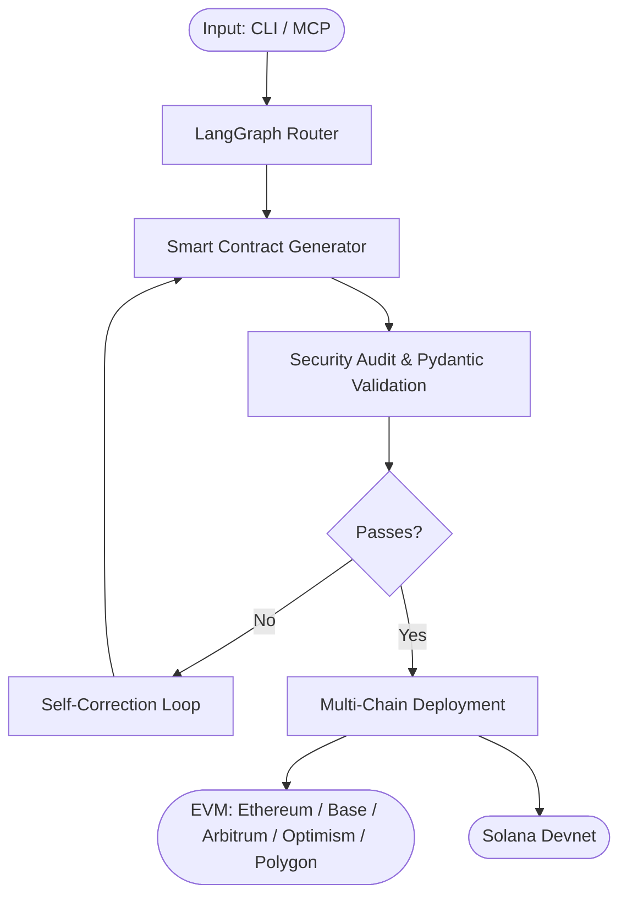

<div align="center">


<h2>An autonomous AI agentic system for smart contract generation,<br/>automated auditing, and self-correcting codebase execution<br/>across multi-chain ecosystems.</h2>

[](LICENSE)
[](https://python.org)
[](https://github.com/langchain-ai/langgraph)
[](https://modelcontextprotocol.io)
[](https://www.typescriptlang.org/)
[](https://ethereum.org)
[](https://solana.com)
[](https://anthropic.com)

</div>

---

## What is AURA Forge?

**AURA Forge** is an AI-powered smart contract development platform that takes you from a plain-English description to a compiled, security-audited, and deployed smart contract — without leaving the terminal or browser.

It supports two ecosystems:

- **EVM** — Real Solidity source compiled with `solc`, with a self-healing LLM retry loop that automatically fixes compiler errors. Deployable to Ethereum, Base, Arbitrum, Optimism, and Polygon.
- **Solana** — Real Anchor/Rust source with a full IDL, generated by Claude and ready for on-chain deployment.

---

## Architecture



---

## ⚡ Quickstart

```bash
# 1. Clone the repository
git clone https://github.com/Harmain11/Cross-Chain-Hub.git
cd Cross-Chain-Hub

# 2. Install dependencies
pip install -r requirements.txt

# 3. Run the primary CLI
python -m aura_forge.cli --help
```

> **Prerequisites:** Python 3.10+, Node.js 18+, an Anthropic API key set as `ANTHROPIC_API_KEY`.

---

## Features

| Feature | Description |
|---|---|
| 🤖 **AI Contract Generation** | Describe in plain English → get production-ready Solidity or Anchor/Rust |
| 🔒 **Automated Security Audit** | Built-in audit pipeline with scoring, vulnerability detection, and Pydantic validation |
| 🔄 **Self-Correction Loop** | Compiler errors and audit failures are automatically fed back to the LLM for repair |
| ⛓️ **Multi-Chain Deployment** | One command deploys to EVM testnets or Solana Devnet |
| 🖥️ **CLI & MCP** | Use from the terminal or as an MCP tool inside any compatible AI assistant |
| 📡 **LangGraph Orchestration** | Stateful agentic workflows with full observability |

---

## Project Structure

```
Cross-Chain-Hub/
├── packages/
│   ├── cli/          # @aura-forge/cli — interactive terminal REPL
│   └── mcp/          # @aura-forge/mcp — Model Context Protocol server
├── artifacts/
│   ├── aura-forge/          # Main web app (React + Vite)
│   ├── aura-forge-landing/  # Marketing landing page
│   ├── aura-forge-pitch/    # Pitch deck slides
│   └── api-server/          # Express.js backend
├── CONTRIBUTING.md
└── README.md
```

---

## Contributing

We welcome contributions of all kinds — bug fixes, new chain integrations, validation rules, and CLI flags. See [CONTRIBUTING.md](CONTRIBUTING.md) to get started.

---

## License

MIT © [Harmain11](https://github.com/Harmain11)
